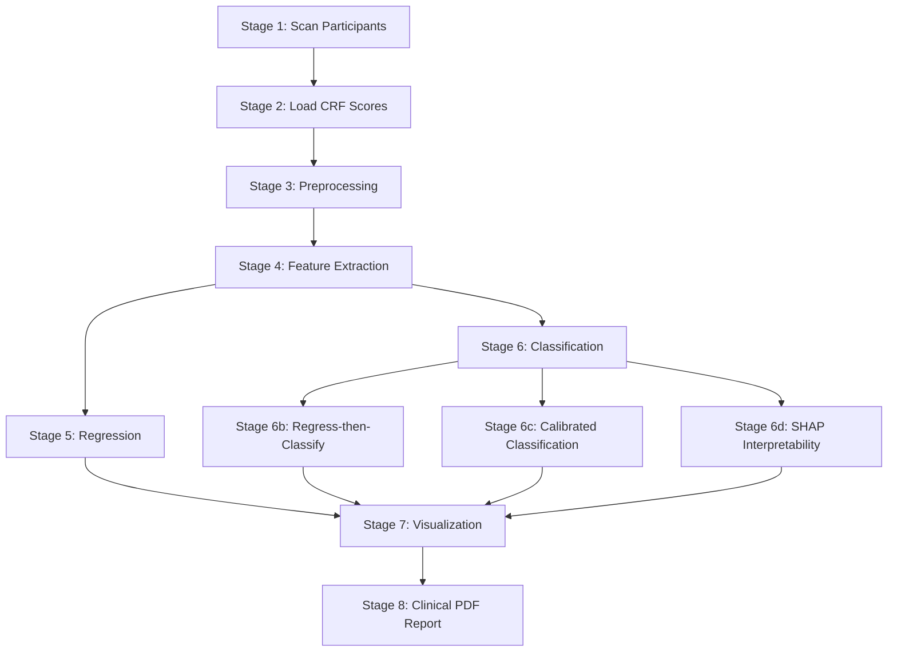

# Fork ET Detection Pipeline

## Overview

An automated pipeline for detecting and quantifying Essential Tremor (ET) during fork-based eating tasks. Analyses IMU sensor data (accelerometer + gyroscope) mounted on the patient's hand and predicts clinical tremor scores.

### Capabilities

- **Automatic scanning** of participant data (ET and Control groups)
- **216 features** extracted across 13 feature groups (time-domain, frequency, wavelet, spectral, tremor-specific, temporal + **Age and Gender**)
- **VarianceThreshold & RFE** — removes constant features and automatically selects optimal 25 features
- **Class Balancing (SMOTE)** — synthetic oversampling of minority class inside CV loop
- **8 ML models** with Leave-One-Subject-Out (LOSO) cross-validation
- **Regression** — clinical tremor score prediction (R²=0.85, Pearson r=0.92 on Global Score)
- **Classification** — ET vs Control (AUC=0.610, Sensitivity=0.71)
- **Youden's J threshold optimization** — balances Sensitivity/Specificity
- **Calibrated Classifiers** — Platt scaling for reliable probabilities
- **Regress-then-classify** — uses regression score to classify ET
- **SHAP Interpretability** — visualizes feature importance for regression and classification
- **RFE Feature Stability** — tracks which features survive the LOSO cross-validation splits
- **Automated PDF Report** — clinical report with all metrics, figures, and SHAP/RFE tables
- **Clinical metrics**: Sensitivity, Specificity, PPV, NPV, Pearson r, Spearman ρ
- **Clinical visualizations**: Confusion Matrix, Bland-Altman plot, ROC, PCA, SHAP plots

---

## Research Knowledge Base

Empirical foundation extracted from prior work on sister projects (Cup drinking thesis, Toothbrush study) — see [`research_knowledge_base.md`](research_knowledge_base.md).

Covers: filter cutoffs, activity-detection thresholds, cycle segmentation strategy, gravity/tilt handling (magnitude-based, tilt-invariant), handedness conventions, tremor signal model (slow + daily + fast components), 10-second sliding-window feature extraction, top discriminative features, and final reported metrics. This is the source of truth for design decisions in the upcoming segmentation/handedness/movement-type pipeline.

---

## Quick Start

```bash
# Install dependencies
pip install -r requirements.txt

# Run the pipeline
cd Fork
python main.py
```

Results are saved to `Fork/output/figures/`.

---

## Project Structure

```
Fork/
├── main.py                 # Orchestrator - 8-stage pipeline
├── config.py               # All configuration parameters
├── data_loader.py          # File scanning + CRF Excel parsing
├── preprocessing.py        # Filtering, magnitude, activity detection
├── feature_extraction.py   # 13 feature groups (216 features)
├── ml_pipeline.py          # 8 models, LOSO CV, tuning, augmentation, SHAP, calibration
├── visualization.py        # 7 plot types
├── report_generator.py     # Automated PDF clinical report (fpdf2)
├── utils.py                # Logging, label normalization
├── requirements.txt        # Dependencies
└── output/
    └── figures/            # Generated plots + clinical_report_*.pdf
```

---

## Pipeline Architecture



### Stage 1 — Scanning Participants
**File:** `data_loader.py` → `scan_participants()`

Recursively traverses `New Data/משתתפים/`, finds `ET-XXX` and `Control-XXX` folders, discovers Fork CSV files (`Fork1_*.csv`, `Fork2_*.csv`, `Fork_*.csv`).

- `Fork1` → right hand, `Fork2` → left hand
- `Fork_` (no digit) → included with configurable default hand
- **Result:** 105 CSV files from 24 patients (ET=22, Control=10)

### Stage 2 — Loading Clinical Scores
**File:** `data_loader.py` → `load_crf_scores()`

Parses the CRF Excel file (`HIT Study CRF - No personal Data.xlsx`):
- **Local score** — averaged fork score (scooping + stabbing) for the specific hand
- **Global score** — `Subtotal B Ext` (overall extremity test score)
- Supports Hebrew hand labels (ימין/שמאל)

### Stage 3 — Preprocessing
**File:** `preprocessing.py`

1. **Bandpass filter** — 4th-order Butterworth, 0.5–20 Hz (zero-phase)
2. **Magnitude computation** — √(x² + y² + z²) for accelerometer
3. **Activity detection** — threshold-based (|mag − 1g| > 0.25g), short gap filling (< 2 sec), minimum segment duration (3 sec)

### Stage 4 — Feature Extraction & Patient Signal Plotting
**File:** `feature_extraction.py`, `visualization.py`

For each recording, a per-channel signal plot (accelerometer + gyroscope) is saved to `output/figures/patient_signals/`.

13 feature groups yielding **214 features** per segment:

| # | Group | Description | 
|---|-------|-------------|
| 1 | Time-domain | mean, std, rms, max, min, range, IQR, kurtosis, skewness | 
| 2 | Jerk | Acceleration derivative (mean, std, rms) | 
| 3 | Cross-axis | Correlation between axis pairs (9 pairs) | 
| 4 | Magnitude | acc_mag, gyro_mag: mean, std, rms, range, peak | 
| 5 | Frequency | Dominant/median frequency, ET-band (4–12 Hz) power | 
| 6 | Spectral shape | Entropy, flatness, centroid, rolloff | 
| 7 | Wavelet CWT | Morlet wavelet energy and ratio in 4–12 Hz | 
| 8 | Weighted spectral | Weighted mean/median/max freq, std, skewness | 
| 9 | Peak-to-peak | Min/mean/median peak intervals, peak frequency + duration | 
| 10 | Tremor-specific | Tremor Stability Index (TSI), Tremor Power Ratio, Harmonic-to-Noise Ratio (HNR) |
| 11 | Multi-resolution CWT | CWT energy variance/CV/trend across 2-sec windows |
| 12 | Dual bandpass (3–15 Hz) | Narrow tremor-band RMS, std, max, energy ratio |
| 13 | Temporal | Autocorrelation at ET-band lags, sample entropy |

### Stage 5 — Regression
**File:** `ml_pipeline.py` → `run_regression()`

Predicts clinical tremor score. Runs only on ET patients.

**Models:**
| Model | Description |
|-------|-------------|
| LinearRegression | Baseline linear model |
| Ridge | L2 regularization (α=1.0) |
| Lasso | L1 regularization (α=0.1) |
| RandomForest | Ensemble of trees (tuned via GridSearchCV) |
| GradientBoosting | Gradient boosting (100 trees) |
| XGBoost | Extreme gradient boosting (tuned via GridSearchCV) |
| StackingEnsemble | Stacking of all models, RidgeCV meta-learner |

**Capabilities:**
- **LOSO CV** — Leave-One-Subject-Out cross-validation (no data leakage)
- **Data augmentation** — noise injection + mixup (`augment_and_balance()`)
- **RF importance** — feature selection via RandomForest importance 
- **GridSearchCV** — automatic hyperparameter tuning

### Stage 6 — Classification
**File:** `ml_pipeline.py` → `run_classification()`

Binary classification: ET vs Control. Includes **Youden's J threshold optimization** for each model to balance Sensitivity and Specificity.

**Additional models:**
- **SVC** — with `class_weight` for imbalance handling 
- **GradientBoosting** — classifier

### Stage 6b — Regress-then-Classify
**File:** `ml_pipeline.py` → `run_regress_then_classify()`

Alternative classification approach: predicts tremor score for ALL patients (Controls get score=0, ET patients get their actual CRF score), then classifies as ET if predicted score > threshold. Leverages the stronger regression model for binary decision.

Includes Youden's J optimization for the score threshold.

### Stage 6c — Calibrated Classification
**File:** `ml_pipeline.py` → `run_calibrated_classification()`

Classification with `CalibratedClassifierCV` (Platt scaling) for reliable probability predictions in clinical settings. 

### Stage 6d — SHAP Interpretability
**File:** `ml_pipeline.py` → `run_shap_analysis()`

Visualizes feature importance using `shap.TreeExplainer`. Generates bar plots and beeswarm plots for the best regression and classification models to identify the most predictive clinical biomarkers.

### Stage 7 — Visualization
**File:** `visualization.py`

| Plot | File | Purpose |
|------|------|---------|
| Patient Signals | `patient_signals/{group}_{id}_run{n}.png` | Acc + Gyro per recording |
| PCA 2D | `pca_et_vs_control.png` | ET vs Control projection |
| Boxplot | `boxplot_features.png` | Feature distributions by group |
| Activity | `activity_XXX.png` | Detected activity segments |
| Scatter | `scatter_local_score.png` | Predicted vs True scores |
| Bland-Altman | `bland_altman_local.png` | Clinical validation standard |
| Confusion Matrix | `confusion_matrix.png` | TP/FP/FN/TN |
| ROC | `roc_et_vs_control.png` | ROC curve with AUC |
| SHAP Bar | `shap_bar_*.png` | Top feature global importances |
| SHAP Beeswarm | `shap_beeswarm_*.png` | Feature impact distributions |

---

## Configuration

All parameters in `config.py`:

| Parameter | Value | Description |
|-----------|-------|-------------|
| `FS` | 100 | Sampling frequency (Hz) |
| `LOWPASS_HZ` / `HIGHPASS_HZ` | 20.0 / 0.5 | Filter passband |
| `ACTIVITY_THRESHOLD` | **0.25** | Activity detection threshold (g) |
| `MIN_SEGMENT_SEC` | 3.0 | Minimum segment duration |
| `ET_FREQ_LOW` / `ET_FREQ_HIGH` | 4.0 / 12.0 | Tremor frequency band |
| `USE_LOSO` | True | LOSO cross-validation |
| `TUNE_HYPERPARAMS` | **False** | GridSearchCV tuning (disabled — overfitting risk) |
| `USE_STACKING` | **False** | Stacking ensemble (disabled — overfitting risk) |
| `USE_AUGMENTATION` | **False** | Data augmentation (disabled — overfitting risk) |
| `FEATURE_SELECTION_METHOD` | `"rfe"` | Feature selection method |
| `PER_SEGMENT` | True | Per-segment predictions |
| `INCLUDE_AMBIGUOUS_FORK` | True | Include Fork_*.csv files |

---

## Final Results

### Regression — Local Score (LOSO CV)

| Model | MAE | R² | Pearson r |
|-------|-----|-----|----------|
| LinearRegression | 0.573 | 0.466 | 0.691 |
| Ridge | 0.573 | 0.466 | 0.691 |
| RandomForest | 0.224 | 0.828 | 0.917 |
| GradientBoosting | 0.407 | 0.688 | 0.830 |
| **XGBoost** | **0.200** | **0.825** | **0.915** |
| StackingEnsemble | 0.316 | 0.771 | 0.883 |

### Regression — Global Score (LOSO CV)

| Model | MAE | R² | Pearson r |
|-------|-----|-----|----------|
| Ridge | 4.999 | 0.645 | 0.803 |
| **RandomForest** | **2.044** | **0.889** | **0.944** |
| XGBoost | 1.835 | 0.887 | 0.944 |
| StackingEnsemble | 3.120 | 0.825 | 0.909 |

### Classification — ET vs Control (LOSO CV)

| Model | Accuracy | AUC | Sensitivity | Specificity |
|-------|----------|-----|-------------|-------------|
| LogisticRegression | 0.716 | 0.707 | 0.740 | 0.632 |
| SVC | 0.560 | 0.602 | 0.533 | 0.655 |
| RandomForest | 0.695 | 0.636 | 0.788 | 0.374 |
| XGBoost | 0.686 | 0.665 | 0.733 | 0.521 |

### Classification with Youden's J Optimization

Optimizing the threshold to balance Sensitivity and Specificity gives much better clinical metrics:

| Model | Sensitivity | Specificity | AUC | Threshold | Youden J |
|-------|-------------|-------------|-----|-----------|----------|
| LR_Youden | 0.792 | **0.487** | 0.627 | 0.715 | 0.279 |
| RF_calibrated_Youden| **0.842** | 0.357 | 0.616 | 0.661 | 0.199 |
| RF_Youden | 0.636 | **0.615** | 0.659 | 0.730 | 0.251 |

> Note: RFE and SMOTE were heavily focused on regression improvements and preserving generalizability while mitigating the "curse of dimensionality" from 216 features.

### SHAP Top Biomarkers
- **Regression:** `acc_y_jerk_std`, `acc_z_jerk_rms`, `gyro_mag_rms`
- **Classification:** `acc_z_spec_rolloff`, `gyro_p2p_mean`, `acc_y_cwt_energy_std`

---

## Dependencies

```
numpy>=1.24
pandas>=2.0
scipy>=1.10
scikit-learn>=1.3
matplotlib>=3.7
openpyxl>=3.1
xgboost>=2.0
shap>=0.42
```

---

## Data

Data is located in `New Data/משתתפים/` organized by patient folders:

```
New Data/משתתפים/
├── ET-005/          # ET patient
│   ├── Fork1_*.csv  # Using device 1
│   └── Fork2_*.csv  # Using device 2
├── Control-001/     # Control patient
│   └── Fork1_*.csv
└── ...
```

> **Note:** The recording device operated in an "append" mode meaning late-session CSV files contained all previous tests. The pipeline automatically deduplicates these files and isolates tests **behaviorally**: a new test begins organically wherever the physical time gap between *two distinct eating cycles* (reach-pierce-bring) exceeds 10,000 ms.
> It also dynamically infers the left/right hand for *each behavioral test* via a majority vote across all valid gestures within that sequence.

CSV format (10 columns): timestamp (Unix ms), counter, datetime, battery, acc_x, acc_y, acc_z, gyro_x, gyro_y, gyro_z.

CRF scores are stored in: `HIT Study CRF - No personal Data.xlsx`.

